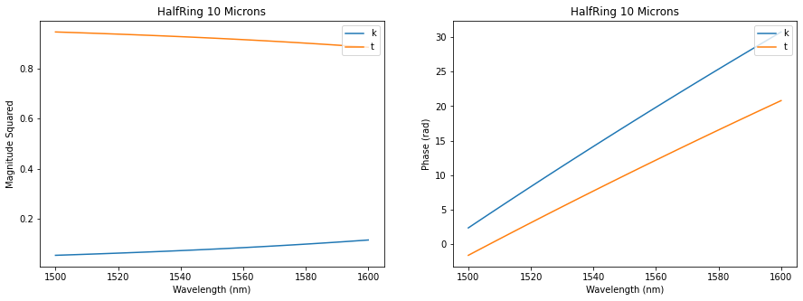
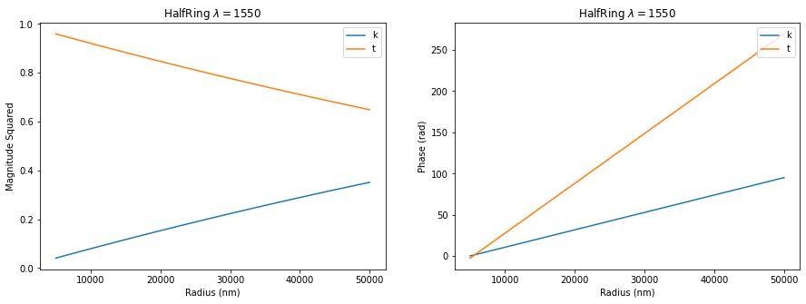

Half Ring Resonator
===================

We’ll briefly show you how to simulate a half ring resonator using
``SiPANN.scee``.

First do the imports

.. code:: ipython3

    import numpy as np
    import matplotlib.pyplot as plt
    from SiPANN.scee import HalfRing
    
    def pltAttr(x, y, title=None, legend='upper right', save=None):
        if legend is not None:
            plt.legend(loc=legend)
        plt.xlabel(x)
        plt.ylabel(y)
        if title is not None:
            plt.title(title)
        if save is not None:
            plt.savefig(save)

Declare all of our geometries (note they’re all in nm)

.. code:: ipython3

    r = 10000
    w = 500
    t = 220
    wavelength = np.linspace(1500, 1600)
    gap = 100

And we can simulate using either ``Halfring.sparams`` or
``Halfring.predict()``. Using ``predict()`` this looks like

.. code:: ipython3

    hr = HalfRing(w, t, r, gap)
    k = hr.predict((1,4), wavelength)
    t = hr.predict((1,3), wavelength)

And if you want to visualize what the device looks like,

.. code:: ipython3

    hr.gds(view=True,extra=0,units='microns')

.. figure:: HalfRing_files/gdsView.png
   :alt: gds

   gds

And plotting the output gives us

.. code:: ipython3

    plt.figure(figsize=(15,5))
    plt.subplot(121)
    plt.plot(wavelength, np.abs(k)**2, label='k')
    plt.plot(wavelength, np.abs(t)**2, label='t')
    pltAttr('Wavelength (nm)', 'Magnitude', 'HalfRing 10 Microns')
    plt.subplot(122)
    plt.plot(wavelength, np.unwrap(np.angle(k)), label='k')
    plt.plot(wavelength, np.unwrap(np.angle(t)), label='t')
    pltAttr('Wavelength (nm)', 'Phase (rad)', 'HalfRing 10 Microns')
    plt.savefig("halfring_output_wavelength.png")

SCEE also supports sweeping over geometries while holding wavelengths
fixed. This can be done as:

.. code:: ipython3

    r = np.linspace(5000, 50000, 100)
    wavelength = 1550
    hr.update(radius=r)
    
    k = hr.predict((1,4), wavelength)
    t = hr.predict((1,3), wavelength)
    
    plt.figure(figsize=(15,5))
    plt.subplot(121)
    plt.plot(r, np.abs(k)**2, label='k')
    plt.plot(r, np.abs(t)**2, label='t')
    pltAttr('Radius (nm)', 'Magnitude', 'HalfRing $\lambda=1550$')
    plt.subplot(122)
    plt.plot(r, np.unwrap(np.angle(k)), label='k')
    plt.plot(r, -np.unwrap(np.angle(t)), label='t')
    pltAttr('Radius (nm)', 'Phase (rad)', 'HalfRing $\lambda=1550$')
    plt.savefig("halfring_output_radius.png")

All elements found in SiPANN.scee can be simulated basically
identically. If you’d like this in script form, it can be found on
github,
`here <https://github.com/contagon/SiPANN/blob/master/examples/Tutorials/HalfRing.ipynb>`__

