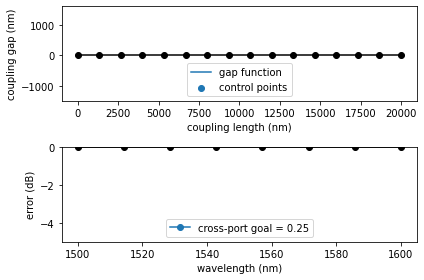
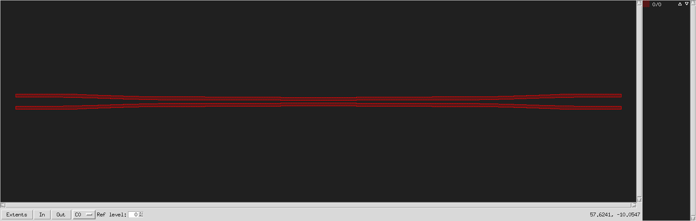
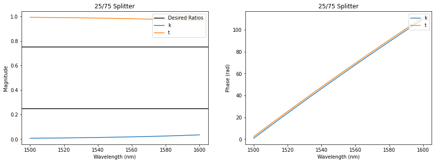

Inverse Design using SCEE
=========================

Do to how fast SCEE is, inverse design of power splitting directional
couplers can be achieved via an optimizer. This has been implemented and
can be used via the ``SiPANN.scee_opt`` module, speficially the
``make_coupler`` function. It implements a global optimization, then a
local optimization to best find the ideal coupler.

This is done by defining the length of the coupler and various control
points along the coupler as parameters that our optimizer can choose
that result in a :math:`\kappa` closest to :math:`\kappa_{goal}`. The
coupler is then defined using the control points plugged into a Bezier
Curve. Note that the Bezier curve defined by the control points is the
gap between waveguides, not the geometry of the waveguides themselves.
However, since each of these directional couplers is symmetric the inner
boundary of the waveguides are just half of the gap.

Further, for our objective function, we compute :math:`\kappa` for a
sweep of wavelength points using SCEE, and then calculate the MSE by
comparing it to :math:`\kappa_{goal}`. Various constraints are also put
on the coupler, like ensuring the edges of the coupler are far enough
apart and making sure there’s no bends that are too sharp. To learn more
about the process, see [INSERT PAPER WHEN PUBLISHED].

.. code:: ipython3

    import numpy as np
    import matplotlib.pyplot as plt
    from SiPANN import scee_opt, scee
    
    def pltAttr(x, y, title=None, legend='upper right', save=None):
        if legend is not None:
            plt.legend(loc=legend)
        plt.xlabel(x)
        plt.ylabel(y)
        if title is not None:
            plt.title(title)
        if save is not None:
            plt.savefig(save)

Most of the defaults parameters for ``SiPANN.scee_opt.make_coupler``
have been set because they work well, so if you don’t know what you’re
doing, it’s generally best to stick with them. Here we make a coupler
with 25% of the light coming out of the through port. It will return an
instance of ``SiPANN.scee.GapFuncSymmetric``, the control points chosen,
and the final length of the coupler.

.. code:: ipython3

    width = 500
    thickness = 220
    coupler, gap_pts, length = scee_opt.make_coupler(goalK=.25, verbose=1, width=500, thickness=220)

.. parsed-literal::

    LOCAL, MSE: 7.3049, Mean currK: 0.0006: : 200it [02:06,  1.49it/s] 

We can easily save it to an npz file for later use using
``SiPANN.scee_opt.save_coupler``

.. code:: ipython3

    scee_opt.save_coupler(width, thickness, gap_pts, length, "test_coupler.npz")

And then reload it using the ``SiPANN.scee_opt.load_coupler``. This will
return us an instance of ``SiPANN.scee.GapFuncSymmetric``.

.. code:: ipython3

    coupler = scee_opt.load_coupler("test_coupler.npz")

And we’ll check what it looks like and make sure it performs as we
anticipated.

.. code:: ipython3

    coupler.gds(view=True,extra=0,units='microns')

   coupler

.. code:: ipython3

    wavelength = np.linspace(1500, 1600, 100)
    k = coupler.predict((1,4), wavelength)
    t = coupler.predict((1,3), wavelength)
    
    plt.figure(figsize=(15,5))
    plt.subplot(121)
    plt.axhline(.25, c='k', label="Desired Ratios")
    plt.axhline(.75, c='k')
    plt.plot(wavelength, np.abs(k)**2, label='k')
    plt.plot(wavelength, np.abs(t)**2, label='t')
    pltAttr('Wavelength (nm)', 'Magnitude', '25/75 Splitter')
    plt.subplot(122)
    plt.plot(wavelength, np.unwrap(np.angle(k)), label='k')
    plt.plot(wavelength, np.unwrap(np.angle(t)), label='t')
    pltAttr('Wavelength (nm)', 'Phase (rad)', '25/75 Splitter')

For your convenience, this has been done for a variety of splitting
ratios already and they all can be loaded using
``SiPANN.scee_opt.premade_coupler``. To learn more about how to use that
see the tutorial on Premade Couplers via Inverse Design.

If you’d like this tutorial as a jupyter notebook, it can be found on
github,
`here <https://github.com/contagon/SiPANN/blob/master/examples/Tutorials/InverseDesign.ipynb>`__
