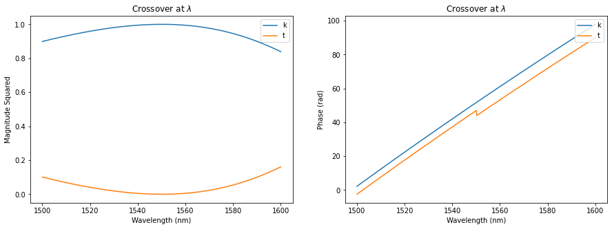
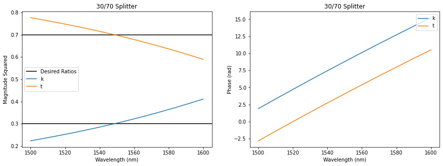

Premade Couplers via Inverse Design
===================================

Using an inverse design optimizer and SCEE, various power splitting
couplers at various splitting ratios have been designed and saved for
future use. These can be loaded using
``SiPANN.scee_opt.premade_coupler`` module. We’ll go through how to load
them here.

.. code:: ipython3

    import numpy as np
    import matplotlib.pyplot as plt
    from SiPANN import scee_opt, scee
    
    def pltAttr(x, y, title=None, legend='upper right', save=None):
        if legend is not None:
            plt.legend(loc=legend)
        plt.xlabel(x)
        plt.ylabel(y)
        if title is not None:
            plt.title(title)
        if save is not None:
            plt.savefig(save)

Crossover
---------

Premade couplers can be loaded via the
``SiPANN.scee_opt.premade_coupler`` function. It takes in a desired
percentage output of the throughport. The only percentages available are
10, 20, 30, 40, 50, and 100 (crossover). It returns a instance of
``SiPANN.scee.GapFuncSymmetric`` with all it’s usual functions and
abilities, along with the coupler length in nanometers.

If you desire other ratios, see the tutorial on
``SiPANN.scee_opt.make_coupler``, where the inverse design optimizer can
be used to make arbitrary splitting ratios.

.. code:: ipython3

    crossover, length = scee_opt.premade_coupler(100)
    crossover.gds(view=True,extra=0,units='microns')

.. figure:: PreMadeCouplers_files/crossover.png
   :alt: crossover

   crossover

.. code:: ipython3

    wavelength = np.linspace(1500, 1600, 500)
    k = crossover.predict((1,4), wavelength)
    t = crossover.predict((1,3), wavelength)
    
    plt.figure(figsize=(15,5))
    plt.subplot(121)
    plt.plot(wavelength, np.abs(k)**2, label='k')
    plt.plot(wavelength, np.abs(t)**2, label='t')
    pltAttr('Wavelength (nm)', 'Magnitude Squared', 'Crossover at $\lambda \approx 1550nm$')
    plt.subplot(122)
    plt.plot(wavelength, np.unwrap(np.angle(k)), label='k')
    plt.plot(wavelength, np.unwrap(np.angle(t)), label='t')
    pltAttr('Wavelength (nm)', 'Phase (rad)', 'Crossover at $\lambda \approx 1550nm$')

30/70 Splitter
--------------

For further demonstration, we also load a 30/70 splitter.

.. code:: ipython3

    splitter, length = scee_opt.premade_coupler(30)
    splitter.gds(view=True,extra=0,units='microns')

.. figure:: PreMadeCouplers_files/splitter.png
   :alt: splitter

   splitter

.. code:: ipython3

    wavelength = np.linspace(1500, 1600, 500)
    k = splitter.predict((1,4), wavelength)
    t = splitter.predict((1,3), wavelength)
    
    plt.figure(figsize=(15,5))
    plt.subplot(121)
    plt.axhline(.3, c='k', label="Desired Ratios")
    plt.axhline(.7, c='k')
    plt.plot(wavelength, np.abs(k)**2, label='k')
    plt.plot(wavelength, np.abs(t)**2, label='t')
    pltAttr('Wavelength (nm)', 'Magnitude Squared', '30/70 Splitter', legend='center left')
    plt.subplot(122)
    plt.plot(wavelength, np.unwrap(np.angle(k)), label='k')
    plt.plot(wavelength, np.unwrap(np.angle(t)), label='t')
    pltAttr('Wavelength (nm)', 'Phase (rad)', '30/70 Splitter')

If you’d like this tutorial as a jupyter notebook, it can be found on
github,
`here <https://github.com/contagon/SiPANN/blob/master/examples/Tutorials/PreMadeCouplers.ipynb>`__

