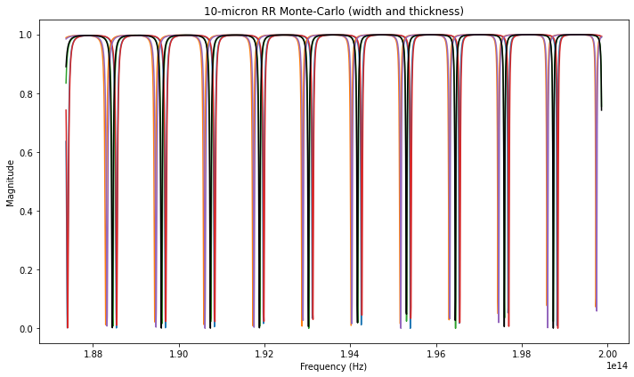
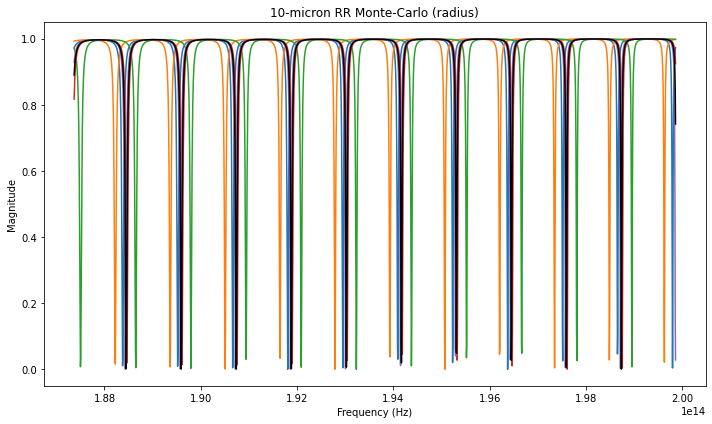

SCEE and Simphony
=================

SiPANN includes a module that wraps all of the models produced by SCEE
for easy use in
`simphony <https://simphonyphotonics.readthedocs.io/en/latest/>`__,
allowing for cascading devices to make complex structures. This gives
the user multiple options (Interconnect or Simphony) to cascade devices.

The SCEE wrapper can be found in ``SiPANN.scee_int``.

.. code:: ipython3

    from SiPANN import scee
    from SiPANN.scee_int import SimphonyWrapper
    
    from simphony.library import ebeam
    from simphony.netlist import Subcircuit
    from simphony.simulation import SweepSimulation, MonteCarloSweepSimulation
    
    import matplotlib.pyplot as plt
    import numpy as np

Standard Simulation
-------------------

First we’ll make our device like we always have using ``SiPANN.scee``.

.. code:: ipython3

    r = 10000
    w = 500
    t = 220
    wavelength = np.linspace(1500, 1600)
    gap = 100
    
    hr = scee.HalfRing(w, t, r, gap)

Simply put our device into the simphony wrapper.

.. code:: ipython3

    s_hr = SimphonyWrapper(hr)

Then use in simphony like you would any other device. Here we’ll make a
ring resonator as an example.

.. code:: ipython3

    def make_ring(half_ring):
        term = ebeam.ebeam_terminator_te1550()
    
        circuit = Subcircuit()
        circuit.add([
            (half_ring, 'input'),
            (half_ring, 'output'),
            (term, 'terminator')
        ])
    
        circuit.elements['input'].pins = ('pass', 'midb', 'in', 'midt')
        circuit.elements['output'].pins = ('out', 'midt', 'term', 'midb')
    
        circuit.connect_many([
            ('input', 'midb', 'output', 'midb'),
            ('input', 'midt', 'output', 'midt'),
            ('terminator', 'n1', 'output', 'term')
        ])
        
        return circuit

.. code:: ipython3

    # Simphony takes in wavelength values in meters
    circuit = make_ring(s_hr)
    sim1 = SweepSimulation(circuit, 1500e-9, 1600e-9)
    res1 = sim1.simulate()
    
    f1, s = res1.data(res1.pinlist['in'], res1.pinlist['pass'])
    plt.figure(figsize=(10,6))
    plt.plot(f1, s)
    plt.title("10-micron Ring Resonator")
    plt.tight_layout()
    plt.show()

.. image:: Simphony_files/Simphony_10_0.png

Monte-Carlo Simulations
-----------------------

``SimphonyWrapper`` also functions with monte_carlo simulations. It
allows ANY of the parameters set in SiPANN to be used. To use it you
must include a dictionary mapping the parameter you wish to perturb to a
standard deviation in nm.

.. code:: ipython3

    sigmas = {"width": 2, "thickness": 1}
    s_hr = SimphonyWrapper(hr, sigmas)

And then simply make our circuit as before, and run through monte-carlo
simulations

.. code:: ipython3

    circuit = make_ring(s_hr)
    #run monte carlo simulation
    simulation = MonteCarloSweepSimulation(circuit, 1500e-9, 1600e-9)
    runs = 5
    result = simulation.simulate(runs=runs)
    
    #plot
    plt.figure(figsize=(10,6))
    for i in range(1, runs + 1):
        f, s = result.data('in', 'pass', i)
        plt.plot(f, s)
    
    # The data located at the 0 position is the ideal values.
    f, s = result.data('in', 'pass', 0)
    plt.plot(f, s, 'k')
    plt.title("10-micron RR Monte-Carlo (width and thickness)")
    plt.tight_layout()
    plt.show()

As an example, we’ll do another simulation, but this time varying radius
of the ring only. Note we could vary both sides of the ring
independently as well (ie the gap distance on each side isn’t
necessarily going to be equal), but for simplicity using our
``make_ring`` function we have identical halves.

.. code:: ipython3

    sigmas = {"radius": 20}
    s_hr = SimphonyWrapper(hr, sigmas)
    
    circuit = make_ring(s_hr)
    #run monte carlo simulation
    simulation = MonteCarloSweepSimulation(circuit, 1500e-9, 1600e-9)
    runs = 5
    result = simulation.simulate(runs=runs)
    
    #plot
    plt.figure(figsize=(10,6))
    for i in range(1, runs + 1):
        f, s = result.data('in', 'pass', i)
        plt.plot(f, s)
    
    # The data located at the 0 position is the ideal values.
    f, s = result.data('in', 'pass', 0)
    plt.plot(f, s, 'k')
    plt.title("10-micron RR Monte-Carlo (radius)")
    plt.tight_layout()
    plt.show()

This is available as a jupyter notebook
`here <https://github.com/contagon/SiPANN/blob/master/examples/Tutorials/Simphony.ipynb>`__

